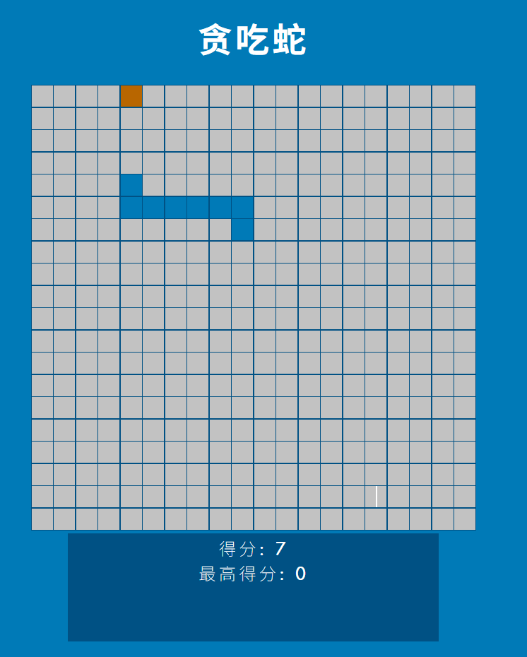

<a href="https://github.com/CursedPrograms/cursed-snake/actions/workflows/auto-assign.yml">
    
</a>

<a href="https://github.com/CursedPrograms/cursed-snake/actions/workflows/proof-html.yml">
    
</a>

<div align="center">
  
  
  
</div>

# Cursed Snake 贪吃蛇

Cursed Snake is a simple Snake game built using HTML, JavaScript, and CSS. This project hosts the files for the game, and you can play it online by visiting [Cursed Snake](https://cursedprograms.github.io/cursed-snake/).  
贪吃蛇 是一款使用 HTML、JavaScript 和 CSS 构建的简单贪吃蛇游戏。该项目托管了游戏的文件，你可以通过访问 [贪吃蛇](https://cursedprograms.github.io/cursed-snake/) 在线游玩。

## 汉化说明

当前汉化仅适用于 版本：

首先感谢原作者的开源。[原项目地址]()

具体汉化了那些内容，请参考[翻译说明](./翻译说明.md)。

我看不懂代码，所以只做汉化，有问题，请到原作者仓库处反馈。

本人提供这个项目在 NAS、服务器等的有偿远程部署服务，有需要可联系。  
微信号 `E-0_0-` 二维码在最后  
闲鱼搜索用户 `明月人间`  
或者邮箱 `firfe163@163.com`  
如果这个项目有帮到你。欢迎start。

有其他的项目的汉化需求，欢迎提issue。或其他方式联系通知。

### 部署汉化项目

1. 从阿里云或华为云镜像仓库拉取镜像，注意填写镜像标签，镜像仓库中没有`latest`标签

   ```bash
   crpi-aiy5xfxuied4b3f9.cn-chengdu.personal.cr.aliyuncs.com/firfe/cursed-snake:2025.04.15
   ```

2. 部署  
   容器端口3000
     - 命令部署

       ```bash
       docker run -d \
       --name cursed-snake \
       --network bridge \
       --restart always \
       --log-opt max-size=1m \
       --log-opt max-file=3 \
       -p 3000:3000 \
       crpi-aiy5xfxuied4b3f9.cn-chengdu.personal.cr.aliyuncs.com/firfe/cursed-snake:2025.04.15
       ```

     - `compose.yaml`文件部署 👍推荐

       ```yaml
       #version: '3.9'
       services:
         cursed-snake:
           container_name: cursed-snake
           image: crpi-aiy5xfxuied4b3f9.cn-chengdu.personal.cr.aliyuncs.com/firfe/cursed-snake:2025.04.15
           network_mode: bridge
           restart: always
           logging:
             options:
               max-size: 1m
               max-file: '3'
           ports:
             - 3000:3000
       ```

## 修改说明

这里对除了汉化之外的代码修改的说明。  
增加修改部分具体见 [修改说明](./修改说明.md)。

`./README.md` 文件翻译，增加 `## 汉化说明`、`## 修改说明`、`## 汉化效果截图` 部分。

增加目录 `./图片`、`./远程文件`
新增文件 `./.dockerignore`、`./Dockerfile`、`./翻译说明.md`、`./修改说明.md`  

## 汉化效果截图



## Demo 演示

Check out the live demo: [Cursed Snake Demo](https://cursedprograms.github.io/cursed-snake/)  
查看实时演示：[贪吃蛇 演示](https://cursedprograms.github.io/cursed-snake/)


## Features 特性

- **Classic Snake Gameplay:** Navigate the snake to eat food and grow longer.  
  经典贪吃蛇游戏玩法：操控贪吃蛇吃食物并变长。
- **Score Tracking:** Keep track of your score as you eat more food.  
  得分追踪：随着吃到更多食物，跟踪你的得分。
- **Responsive Design:** Play the game on different devices.  
  响应式设计：在不同设备上玩游戏。

## How to Play 如何游戏

1. Visit the [Cursed Snake Demo](https://cursedprograms.github.io/cursed-snake/).  
   访问[贪吃蛇 演示](https://cursedprograms.github.io/cursed-snake/)演示。
2. Use arrow keys to control the snake's direction.  
   使用箭头键控制蛇的方向。
3. Eat the food to grow longer.  
   吃食物以增长长度。
4. Avoid colliding with the snake's own body and the edges of the screen.  
   避免与蛇自身的身体和屏幕边缘相撞。

## Technologies Used 使用技术

- HTML
- JavaScript
- CSS

## License 许可证

This project is licensed under the [MIT License](LICENSE).  
本项目基于 [MIT 许可证](LICENSE)。

---

Enjoy playing Snake!  
享受玩贪吃蛇的乐趣吧！

<a href="https://cursed-entertainment.itch.io/" target="_blank">
    
</a>
